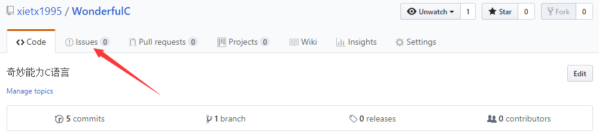
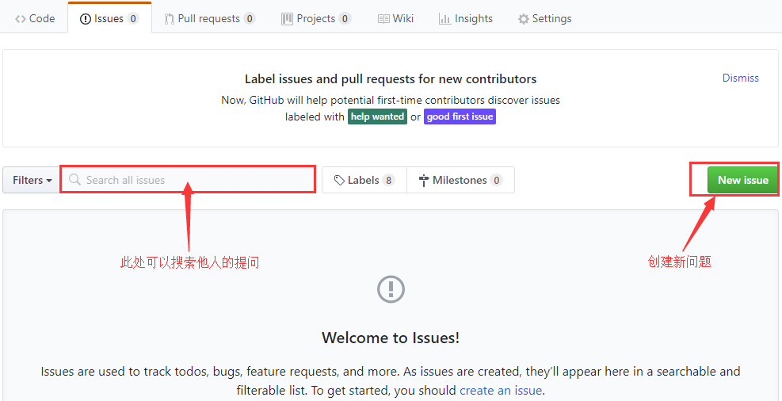
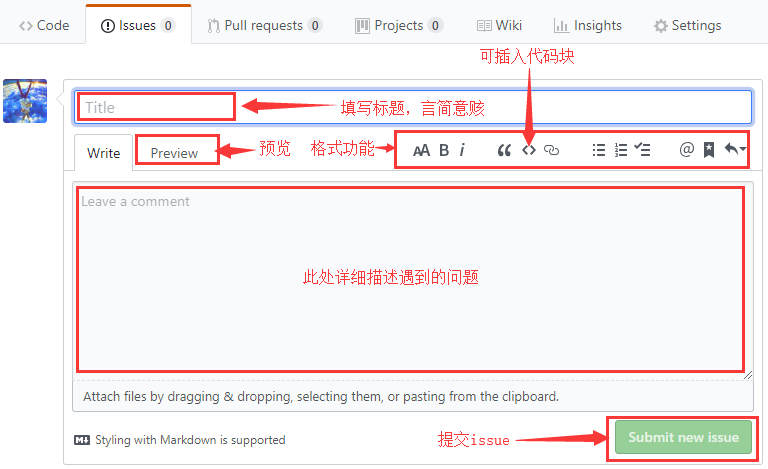

# 如何使用Issue进行提问

如果你在学习过程中，遇到了一些疑惑或者不能解决的问题，可以使用Github的Issue功能进行提问。但是在提问之前，你需要做到以下几点：

- 尝试过检查自己的代码
- 尝试过分析问题出现的原因
- 虽然看不懂报错信息，但是尝试通过词典对不认识的单词进行了翻译
- 尝试复制报错信息，然后使用谷歌或者百度进行了搜索
- 尝试了其他能够独立解决问题的办法

如果通过以上的尝试，你还是不能解决遇到的问题，那么你可以在Issue中提出自己的问题。

## Issues

Issues可以用来跟踪任务、提交Bug信息等，我们也可以用它来提问。下面是使用Issue提问的步骤：

1. 打开Issues页面 
2. 搜索或者创建新的Issue 
3. 填写并提交问题  Github支持markdown语法，点击[此处](https://guides.github.com/features/mastering-markdown/)可以学习。

希望大家善用issue，为你的问题提供尽可能多的信息，这样可以节省大家宝贵的时间。