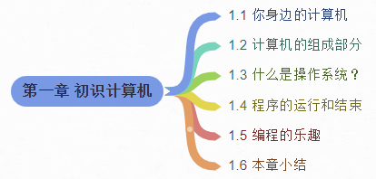

# 1 初识计算机

欢迎来到计算机编程的世界！

计算机能干啥，想必大家都有体会过了：

- 上网、游戏、聊天
- PPT、Word、Excel
- 手机App、电视机里面的App
- 控制冰箱、洗衣机、电饭煲的程序
- 宇宙飞船、导弹、火箭
- 人脸识别、语音识别
- ...

很多初学者由于基础较差，所以在想要入门编程的时候感到手足无措。本章将带大家了解计算机是怎么工作的，计算机中的程序又是怎么工作的，让大家能够掌握一些基本的计算机知识，为后面的C语言学习打一些必要的基础。

## 目录

## 链接

- [目录](./preface.md)
- 下一节：[你身边的计算机](01.1.md)