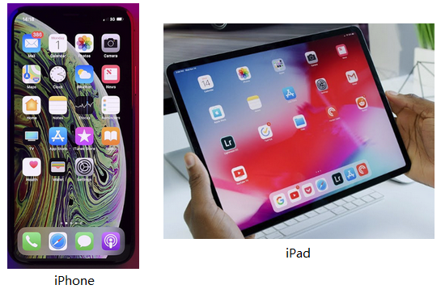
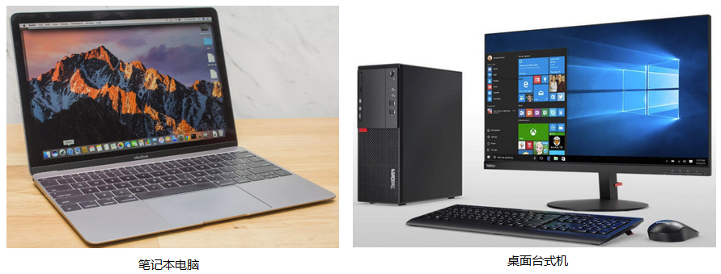
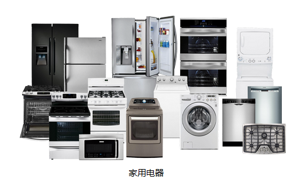

# 1.1 你身边的计算机

在生活中，随处可见计算机的身影。例如大家每天都离不开的手机、经常要用到的电脑、iPad。当然除了这些一眼就能看出来是计算机的设备，在许多物件里面都有小小的计算机呢。

## 手机、平板

手机和平板电脑是我们生活中再常见不过的电子设备了，例如iPhone XS和iPad：

## 笔记本、台式

笔记本电脑和台式电脑也是我们生活中常见的计算机：

## 家用电器

我们日常家庭生活中的很多设备里面都有非常小的计算机设备：

## 小结

除了以上的物品，生活中还有许许多多的计算机设备。我们来简单地思考一下，这些五花八门，成千上万的计算设备都完成了哪些工作呢？你可能会说手机就是用来打电话、玩游戏、聊天的，冰箱就是拿来保存食物，电饭煲就是拿来煮饭的，导弹就是拿来消灭敌人的。那么它们的共同特点是什么呢？

拿手机、冰箱、电饭煲、导弹举例：

- 打电话时，我们**输入**了电话号码，然后点击拨号，然后接通，听筒**输出**了声音，通话完成之后挂断。
- 我们为冰箱设定（**输入**）了温度值，冰箱就会保持内部的温度，温度实际上是由冰箱内部的一些设备（例如压缩机）控制的，而冰箱内部的计算机**输出**了一些信号，来控制这些设备的运转。
- 我们使用多功能电饭煲的时候，设定（**输入**）了功能，控制电饭煲是快煮米饭，煮粥，还是煲汤。而对于不同的功能，电饭煲内部的计算机对加热设备**输出**了不同的控制信号，例如不同的温度和不同的时长。
- 在发射导弹的时候，操作的士兵**输入**了目的地的坐标，导弹中的计算机就会根据坐标计算一系列控制信号，然后将这些控制信号**输出**到导弹的姿态控制设备上。

那么，更加抽象地来说，**计算机就是一类接受输入，并产生输出的设备**。

我们甚至可以试着将生活中的一些现象抽象为计算机的行为，例如炒菜，想一想当你炒菜的时候，计算机是什么呢？输入是什么，输出又是什么呢？

## 链接

- [目录](./preface.md)
- 上一节：[初识计算机](./01.0.md)
- 下一节：[计算机的组成部分](./01.2.md)