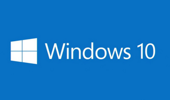
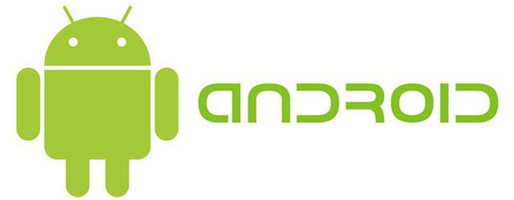
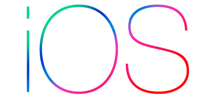
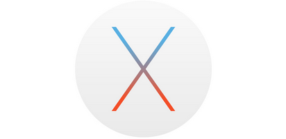
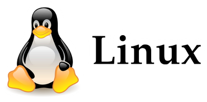
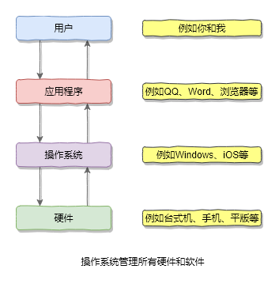

# 1.3 什么是操作系统

在上一节中，我们简单介绍了计算机的组成部分。大家可能会问，计算机的各个部件通过主板连接在一起了之后，怎么就能工作了呢？为什么我按开机键，计算机就启动了呢？

事实上，大家拿到手中的台式机、笔记本或者手机，都是在卖给你之前就已经装好了一个软件，这个软件能够在计算机通电启动之后，管理计算机中的所有部件。这个软件就是我们经常说的操作系统。

如果你的计算机没有安装操作系统，那么计算机是无法帮助你完成大多数工作的。除了我们经常使用的操作系统之外，主板上一般都有一个称为BIOS(Basic Input Output System)的程序，即基本输入输出程序，使用这个程序可以在一定程度上控制计算机中的其他部件，对于初学者来说，我们可以先不用了解。

## 常见的操作系统

我们平时工作和学习中，最常见的操作系统有5种：

- 微软公司开发 Windows 操作系统
- 谷歌公司开发的 Android(安卓) 操作系统
- 苹果公司开发的 IOS 操作系统
- 苹果公司开发的 Mac OS X 操作系统
- 由全世界爱好者共同开发并维护的，免费并且开源的 Linux 操作系统

## Windows

Windows 操作系统是目前在日常工作和生活中使用人数最多的操作系统。用户一般在 Windows 操作系统上进行游戏、文档编辑、视频剪辑、上网、聊天、编程等等各种各样的活动。

## Android(安卓)

安卓系统也是大家耳熟能详的一种操作系统，它通常被安装在手机、平板电脑以及电视机上。我们可以使用安卓系统中的各种各样的App进行各种各样的活动。

## IOS

IOS 是苹果为 iPhone 和 iPad 开发的操作系统，一般只会被安装在苹果的手机和平板电脑中。和安卓系统类似，我们也可以使用 IOS 系统中五花八门的App进行各种活动。

## MAC OS X

MAC OS X 是苹果公司为其笔记本电脑和桌面电脑开发的操作系统，一般只会被安装在苹果的笔记本电脑(例如Macbook Pro)以及台式主机(例如iMac)中。MAC OS X 操作系统中也有很多程序供用户使用，但是数量上远不及 Windows 平台。

## Linux

Linux 是一个免费，而且开放源代码的操作系统，它由全世界的爱好者共同维护和开发。

如果不是计算机专业的同学，可能几乎不会听到 Linux 这个词，但是在我们的生活中却到处都是它的身影。大家平时访问的各种网站，大多数都运行在安装了 Linux 操作系统的服务器上，你家的冰箱、洗衣机、电饭煲等设备里面也可能装有一个非常小的 Linux 操作系统。

Linux能安装在各种各样的设备上，例如笔记本、手机、电视机、平板电脑、路由器、游戏机、台式计算机、大型机和超级计算机等。

## 小结

操作系统是一类软件，它们的功能是管理计算机中所有的**硬件**和**软件**资源，并且操作系统能接受用户的输入并产生输出。我们在电脑、手机等设备上使用的程序都运行在特定的操作系统之中。

通常情况下，我们开发的程序，也运行在操作系统之上。当然，我们也可以编写直接控制硬件的程序，但这不在本教程的范围内。

## 链接

- [目录](./preface.md)
- 上一节：[计算机的组成部分](./01.2.md)
- 下一节：[程序的运行和结束](./01.4.md)