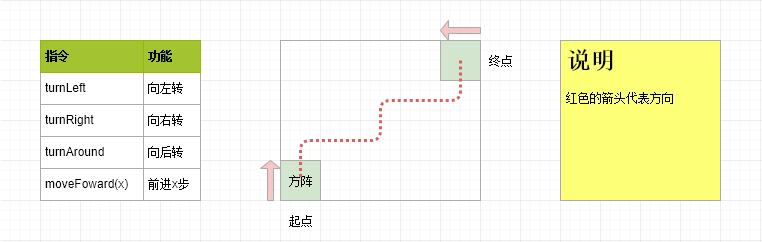
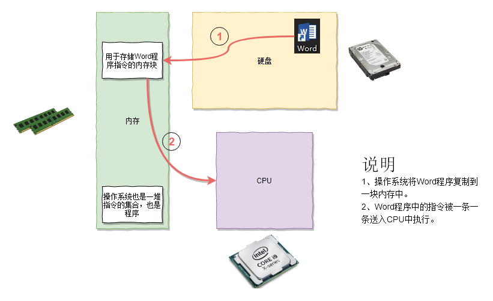

# 1.4 程序的运行和结束（未完成）

在上一节我们介绍了什么是操作系统：


初学者在学习编程的时候，一般不会从操作系统和硬件入门，当然也不会去研究用户。所以，初学编程，我们一般从编写**运行在特定操作系统上的程序**入门。所以我们主要关注的点就是上图中的**应用程序**部分。

你可能会问，操作系统有Windows、Linux、Mac OS X、iOS、Android，我们在哪一个上面编程呢？本教程将选择 Windows 作为我们学习编程的环境，原因如下：

- 初学者使用最多，最熟悉的操作系统是 Windows
- 入门的负担最轻，不需要折腾其他操作系统

## 程序是什么？

你可能会问：程序到底什么？

答案：一个程序是一组为了完成特定任务而编写的**计算机指令的有限的集合**，程序员通常使用一种特定的编程语言（例如C语言）来编写程序。

你可能又问：什么是计算机指令？

大家回忆一下自己参加军训的时候，教官是不是经常会发出一些指令，例如向左、向右、前进等等。大家可以注意到，教官发出的这些指令的数量都是**有限的**，而且一定会有**开始**和**结束**。那么教官掌握的所有指令就构成了一个**指令集**，当他需要使用某些指令的时候，他就可以从自己的指令集合中拿出来使用。

下面我们来写你的第一个“军训程序”。假如你是教官，现在你要编写一个程序，控制方队从左下方按照路线移动到右上方，你可以从左边的指令集合中选取一些指令，来完成这个程序。



那么我们可以写出如下的程序来完成这个任务：

```c
moveFoward(1) // 前进1步
turnRight     // 向右转
moveFoward(3) // 前进3步
turnLeft      // 向左转
moveFoward(1) // 前进1步
turnRight     // 向右转
moveFoward(3) // 前进3步
turnLeft      // 向左转
moveFoward(1) // 前进1步
turnLeft      // 向左转
```

当上面的“程序”运行一遍之后，那么方阵就从起点移动到了终点。

计算机也和一个军训教官类似，它们有自己的指令表，这些指令可以用于各种数学和逻辑运算。大家可以想象计算机的CPU中也存储了一张装满指令的表，而各种各样的**程序**就是这些指令的不同组合。

你电脑和手机中的各种软件和App其实都是很多不同指令的集合。

## 程序存放在哪里？

知道了程序是什么之后，那么程序放在哪里呢？你可能会回答：程序当然是放在计算机里面呀！没错，但是更准确的是，程序放在计算机的硬盘当中，或者手机的闪存当中。大家经常听到的500G硬盘、128G的iPhone，都是描述的硬盘或者闪存的大小。

程序就像你平时编辑的Word文档一样，也是一个文件。Word文档以`.docx`结尾，而程序在Windows中以`.exe`结尾。本质上，他们都是存储在硬盘上一堆数据，只是用途不一样罢了。

## 程序是如何开始运行的？

现在我们已经学习了：

- 程序是一堆有限的指令的集合
- 程序存储在硬盘当中
- 程序也是一种文件

那么程序是如何运行的呢？假如你的桌面上有一个Word程序，当你双击Word的图标的时候，发生了什么呢？

回忆一下，操作系统管理计算机中所有的软件和硬件。当我们双击Word图标时，操作系统首先会分配一块内存，然后会把Word程序中的指令从硬盘复制到这块内存当中。然后这些指令会被一条一条地送到CPU中执行。就这么简单！



## 程序结束时发生了什么？

当Word程序结束时，操作系统会收回分配给Word程序的内存块，之后可能会分配给其他程序使用。而CPU也开始执行其他程序的指令。

## 小结

程序即一堆指令的集合，存储在硬盘中，运行时会被复制到内存中，然后送入CPU执行。

操作系统也是程序，但是它权限更高，能管理其他程序以及所有硬件。

## 链接

- [目录](./preface.md)
- 上一节：[什么是操作系统](./01.3.md)
- 下一节：[编程的乐趣](./01.5.md)