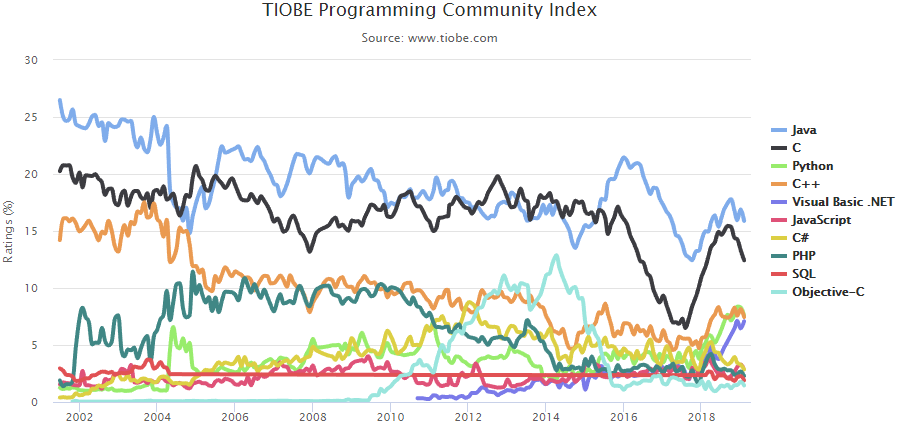

# 2.1 什么是语言？

“语言”这个词，你肯定一点儿也不陌生。

在日常生活中，我们使用汉语、英语或者其他语言进行听、说、读、写，我们使用语言来表达我们的思想。

你可能会说：编写程序的时候，不也是在表达我们的所思所想吗？

是的，所以在设计计算机程序的时候，我们也需要特定的语言作为我们思考和创作的载体，这种为了编写计算机程序而使用的语言，我们称为**编程语言**(Programming Language)。

不同的是，我们使用汉语、英语等书写文章，使用编程语言书写程序。

## 编程语言从何而来

很多同学都玩过网络游戏，比如英雄联盟。我们表达自己赞扬的时候会发送“666”、“NB”等，还有撤退的时候可能会发送“333333333”表示“该闪了、快跑”。因为网络游戏的出现，这些简洁、易于理解的语言也随之而出现了。

编程语言当然也是随着计算机的出现而出现的。目前世界上有成百上千的计算机编程语言，而对整个计算机发展影响最大的便是我们将要学习的C语言。

C语言是由[Dennis Ritchie](https://baike.baidu.com/item/%E4%B8%B9%E5%B0%BC%E6%96%AF%C2%B7%E9%87%8C%E5%A5%87/7267171?fr=aladdin)在1972年设计的，距书写本文时已经47年了，但是它仍然深刻影响着整个计算机行业。

## 语言标准

就像英语有语法规则一样，编程语言也有语法规则。编程语言的语法规则，称为**语言标准**。并且语言标准就像iPhone一样也会更新、也有版本号。iPhone由6、7、8等等，而C语言到目前为止有以下几个标准：

- [ANSI C](https://baike.baidu.com/item/ANSI%20C/7657277?fr=aladdin)，即C89和C90
- [C99](https://baike.baidu.com/item/c99/7335191?fr=aladdin)
- [C11](https://baike.baidu.com/item/C11/3245086?fr=aladdin)
- [C18](https://en.wikipedia.org/wiki/C18_(C_standard_revision)#Changes_from_C11)

因为C18相对于C11只是解决了一些缺陷，并未引入新的特性，所以本教程的所有代码均以C11作为标准。从C语言被发明到现在，其语法基本没有多大变化，所以初学者不用纠结语言标准的问题。（CXX中的XX代表年份，例如C11表示11年发布的版本。）

## 百花齐放的编程语言

就像汉语有四川话、广东话、闽南语等方言一样，在计算机发展的过程中，人们也发明了各种各样的编程语言。

你可能听过Java、Python、Ruby、PHP、JavaScript等等。虽然这些编程语言的语法有很多不同的地方，但是只要掌握了其中一门，也能快速上手，并在短时间内熟悉其他的编程语言。这样说起来，比一个四川人学习广东话要简单很多呢，对吧？

## 这么多语言都是拿来做什么的？

不同的编程语言有不同的优势和用处，下面简单罗列一些，初学者不必深究：

- C语言：计算机世界最基本的高级程序设计语言，主要用于操作系统、硬件、底层软件、服务器等需要超高性能的地方。
- Python：主要用于科学计算、人工智能、web服务器开发等
- Java：主要用于web服务器开发，Android开发等
- JavaScript：主要用于web前端开发以及web服务器开发等

下面是2019年2月编程语言流行排行榜：

大家也可以访问 [https://www.tiobe.com/tiobe-index](https://www.tiobe.com/tiobe-index) 查看最新榜单。

## 小结

编程语言是表达思维和创作的工具，我们使用编程语言来编写计算机程序。

## 链接

- [目录](./preface.md)
- 上一节：[初识编程语言](./02.0.md)
- 下一节：[C语言简介](./02.2.md)