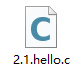
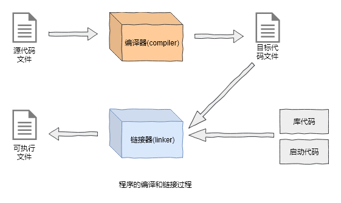

# 2.2 C语言简介

C语言是一门高级编程语言(High-level programming language)，人们使用C语言开发各种各样的软件。

## 高级？

上面说C语言是一门**高级**编程语言，这里的高级是什么意思呢？难道还有低级的编程语言吗？

是的，在计算机世界里面，既有高级的语言也有低级的语言，这里的高级和低级并没有贵和贱的含义，只是这两类不同级别的语言用在不同的地方。目前你所听到的C、Java、Python、PHP、JavaScript等等各种常见的编程语言都是高级编程语言。

而低级语言，指的是计算机能够理解的语言。What？高级？低级？计算机能理解？好乱啊！

别急，看完接下来的讲解你就明白了。

## 源代码

我们使用编程语言编写的代码，称为**源代码**或者**源码**。

下面是C语言的一段源代码，现在你还不需要理解它的含意，你可以把它当作一个普通的文本文件，就像Word文档的`.docx`文件一样。

*代码清单2.1* [hello.c](./src/ch02/2.1.hello.c)

```c
#include <stdio.h>

int main(void)
{
    print("Hello, World!");  // 打印Hello, World!
    return 0;
}
```

我们一般把C语言的源代码保存在以`.c`为后缀名的文件中：



我们所说的编写程序，但多数时候就是在编写这样的源代码文件。看起来很简单吧！虽然你不知道上面代码的用途，但是里面的单词你肯定能认识几个：include、main、void、print、hello、world、return，里面还有数字0，还有一句文字“打印Hello, World!”。

目前你看不懂是因为还没有学习C语言的语法，就像如果你不懂英语语法，也不太看得懂英文一样。

那什么是高级呢？

如果一个编程语言被归类为**高级**的，那么表明这个语言相对于低级语言来说，能够被人类容易地编写和阅读。

根据上面这句话反推，你应该能推测，低级语言有个特征，那就是难以编写和阅读。

## 目标代码

我知道你会问：已经有一个C语言程序的源码文件了，要怎么运行呢？

答：**C语言的源码文件是不能直接运行的**。

你又会问：那要怎么运行呢？

答：C语言的源码文件需要被**编译**和**链接**成可执行文件（在Windows中可执行文件一般以`.exe`结尾），然后这个可执行文件才能被我们双击直接运行。

你会继续问：怎么编译和链接呢？

答：使用一个叫做**编译器**的程序，先将源代码文件编译成**目标代码**文件，然后再使用一个叫做**链接器**的程序，将目标代码文件和其他一些必需的代码链接在一起，形成一个可执行程序。

**目标代码**一般由机器代码或接近于机器语言的代码组成。这里的**机器代码**或者说**机器语言**(Machine Language)就是一类低级的语言，它们对于人类来说很难记忆，而且难以编写和阅读，我们初学编程，不需要学习机器语言。可执行程序一般也由机器代码组成。

你可能又会问：一定要将高级语言写的代码翻译成低级语言吗？

答：是滴！你目前只需知道，人和机器正好相反，机器只能理解低级语言或者说机器语言，而高级语言，例如C语言，出现的原因就是我们需要一种更加通俗易懂易掌握的编程语言。

是不是听起来很复杂？没关系，你现在不需要记住这些东西，这对后面的学些没有任何影响。在下一章，我们会亲自操作整个过程。

希望下面的示意图能先帮助你理解，不理解也没关系，你需要知道源代码是怎么变成我们能双击运行的程序就行了。



## 库代码和启动代码

库代码和启动代码在上图中的右下角，链接器将目标代码和库代码、启动代码整合成为可执行文件。为什么要这么做呢？

因为我们编写的程序，被编译器翻译成目标代码（机器代码或机器语言）之后，仍然不能直接运行，还需要添加一些程序运行所必需的代码，才能够组成可运行的程序。

此处我们也不必深究，并不影响后面的学习。

## 可执行程序

可执行程序就是一组机器代码，在Windows中以`.exe`为后缀名，是可以双击运行的程序。

## 小结

- C语言是一门高级编程语言
- 高级编程语言易于阅读和编写，适合人类使用
- 低级编程语言难以阅读和编写，但适合计算机使用
- C语言程序从编写到成为可执行程序经历了：源代码文件->目标代码文件->可执行文件

## 链接

- [目录](./preface.md)
- 上一节：[什么是语言？](./02.1.md)
- 下一节：[一个C语言程序是如何运行的？](./02.3.md)