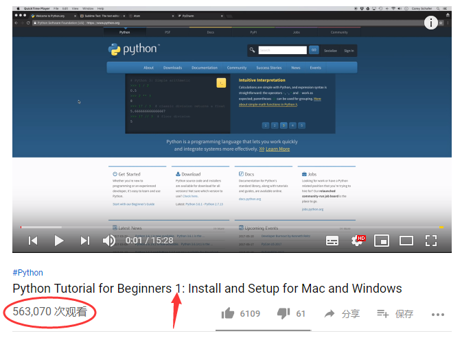
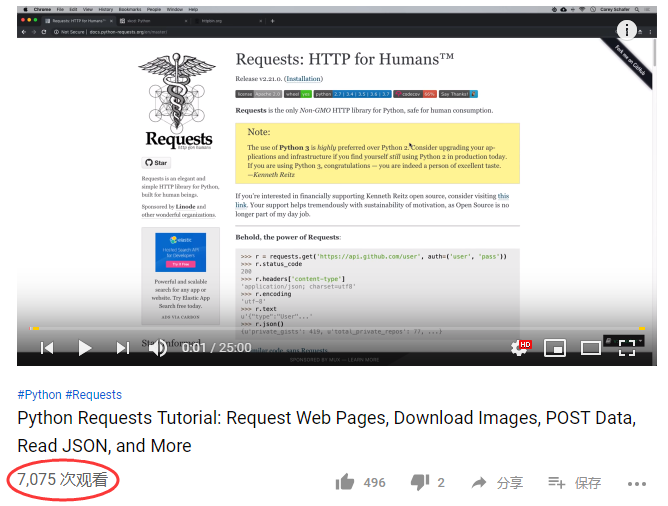
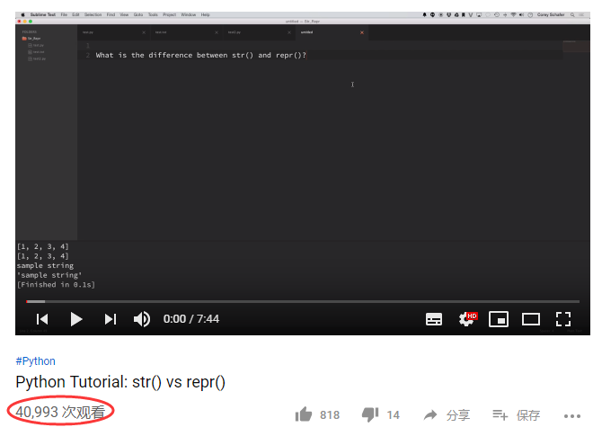

# 2.4 坚持就是胜利！

这一小节，不讲C语言和编程的知识。作者只想强调坚持的重要性，你也许没有别人聪明，但是只要你坚持下去，学完所有内容，相信你一定超过90%以上阅读本教程的人。

为什么呢？我们来观察一个网络教程的播放量，然后推出一个大概的结论。

下面是YouTube上一个Python教程第1集视频的播放量，为563070次。

最后一个视频为第100集，播放量为7075次。

那么可以粗略估算，坚持到最后的人占总人数的1.26%。第一个视频可能由于多次播放，或者有的人只是稍微看一下，并不打算学习，我们来看第50个视频的播放量，为40993：

那么从第50集，坚持到最后第100集的比例为17.26%。也就是说，坚持到最后的，超过了其他80%以上的人。

希望你也成为坚持到最后的人，作为初学编程的你，一定会有巨大的收获。

## 链接

- [目录](./preface.md)
- 上一节：[一个C语言程序是如何运行的？](./02.3.md)
- 下一节：[本章小结](./02.5.md)