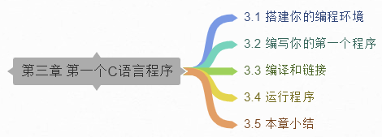

# 3 第一个C语言程序

上一章简要介绍了什么是编程语言，同时描述了从源代码到目标代码再到可执行程序的过程。本章我们将用C语言编写你的第一个程序。

在编写程序之前，我还会向你介绍：编程环境的搭建、C语言程序的构建工具等基础知识。

## 目录

## 链接

- [目录](./preface.md)
- 上一节：[第二章小结](./02.5.md)
- 下一节：[搭建你的编程环境](./03.1.md)