# 3.1 搭建你的编程环境

在编写程序之前，我们应该把相应的工具准备好。

## 什么是编程环境

回忆大家在上初中或者高中的时候，我们做物理、化学或者生物实验的时候，需要准备好实验工具和环境，我们会在专门的实验教室，每人面前都有一个大大的试验台、一些试剂或相关工具。这些构成了我们的实验环境。我们要进行编程这项活动，当然也需要编程的环境。那么编程环境是什么呢？对于初学者，我们的编程环境由以下几项构成：

- 平台，即我们需要在特定的操作系统上进行编程（本教程使用Windows）
- 编辑工具，即我们编程需要的一个代码编辑器来编写代码
- 构建工具，即我们需要一些程序来将源代码转换成可执行程序
- 调试工具，即我们需要一些程序来排查程序中的错误
- 其他工具，我们可能还需要性能测试工具、用于团队合作开发的工具等（目前我们不需要了解这些）

目前也有非常多的集成开发环境(Integrated Development Environment, IDE)，也就是集合了上面各种工具的一类软件，大家一般称这些软件为IDE。例如 [Visual Studio](https://visualstudio.microsoft.com) 是由微软开发的Windows上最强大的IDE。

## 平台

在1.4节，我们介绍了选取Windows的原因：

- 初学者使用最多，最熟悉的操作系统是 Windows
- 入门的负担最轻，不需要折腾其他操作系统

注意：本教程使用的操作系统版本为**Windows 10**。

## 编辑工具

代码是写出来的，所以我们当然需要一个代码编辑器啦。代码编辑器类似文本编辑器，不是IDE。目前有各种各样的编辑器可供我们使用，而且绝大部分都是免费的，下面简单罗列几个：

- [Visual Studio Code](https://code.visualstudio.com/)，简称VS Code。注意VS Code不是上面提到的Visual Studio，虽然他们都由微软开发。
- [Sublime Text 3](http://www.sublimetext.com/)
- [Notepad++](https://notepad-plus-plus.org/)
- ...

除了编辑器之外，还有很多IDE也是编程的得力工具：

- [Visual Studio](https://visualstudio.microsoft.com)
- [Code::Blocks](http://www.codeblocks.org/)
- [Eclipse](https://www.eclipse.org/downloads/)
- ...

为了帮助大家理解程序的构建过程，本教程将先使用VS Code作为代码编辑器。后面也会介绍如何使用Code::Block和Visual Studio。

另外，如果有人对初学者说：“高手都使用Vim、Emacs，你也应该使用”，或者又有人说：“高手都使用记事本的”，请不要听他们胡诌。因为对于新手来说，Vim和Emacs是非常难以掌握的，而且会耗费大量的时间去配置和学习，等你已经能够熟练的编写程序了，再去尝试也不迟。另外，记事本虽然可以用来写程序，但是效率是非常低的。古人云：工欲善其事必先利其器。不同的阶段，选择合适自己的工具才是最正确的。

## 安装VS Code

1. 下载VS Code安装包：
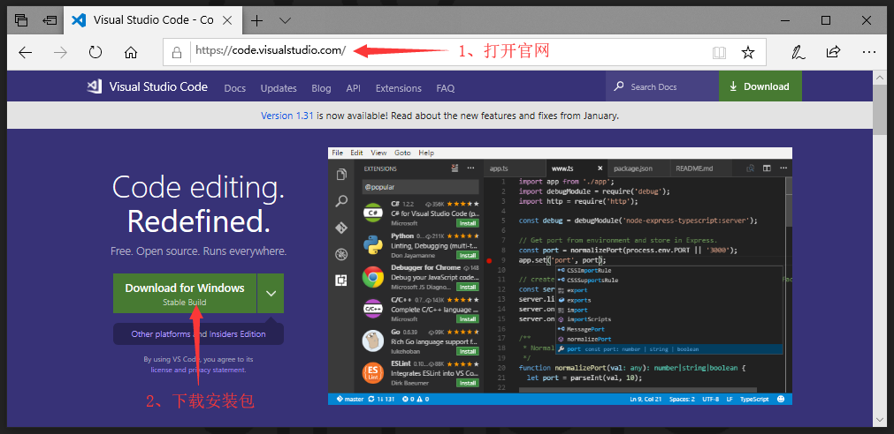
2. 运行安装包进行安装：
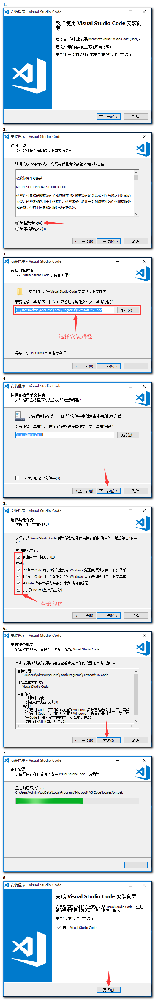
3. 启动后的界面如下：
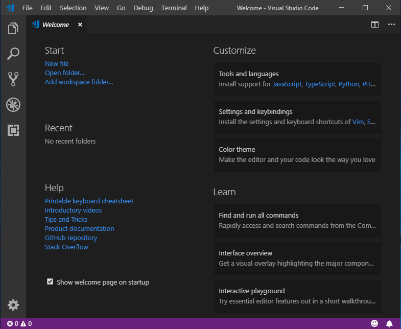

## 构建工具

除了需要使用编辑器编写代码之外，在编写完代码之后，还需要使用构建工具将源代码构建为可执行程序。在第二章我们提到了编译器和链接器，通常这两者都是集成在同一个程序当中的，我们称为C语言的构建工具。最常用的构建工具是[GCC](https://gcc.gnu.org/)(the GNU Compiler Collection)，翻译成中文是GNU编译器套件。为了避免初学者头大，至于[GNU](https://baike.baidu.com/item/gnu/671972?fr=aladdin)是什么，这里不作过多介绍了。你只需要知道GCC是一个免费的构建工具就行了。它能将C语言编译和链接成可执行程序，GCC也支持其他语言，这里不作介绍。

另外，GCC在各个平台上都可以使用。在Windows平台上，我们使用[MinGW](http://www.mingw.org/)(Minimalist GNU for Windows)，它是GCC在Windows上面的版本。

还有相似的构建工具也可以用于在Windows上构建C语言程序：[mingw-w64](http://mingw-w64.org/doku.php)和[Cygwin](https://sourceware.org/cygwin/)。这三者的使用方法都大同小异，但本教程不讨论它们的区别，作为初学者，选择MinGW即可。

## 安装Code::Blocks

[Code::Blocks](http://www.codeblocks.org/)是一个集成开发环境，它的安装包内带有MinGW。因为后面我也会教大家使用IDE，所以安装Code::Blocks一举两得。

1. 下载Code::Blocks
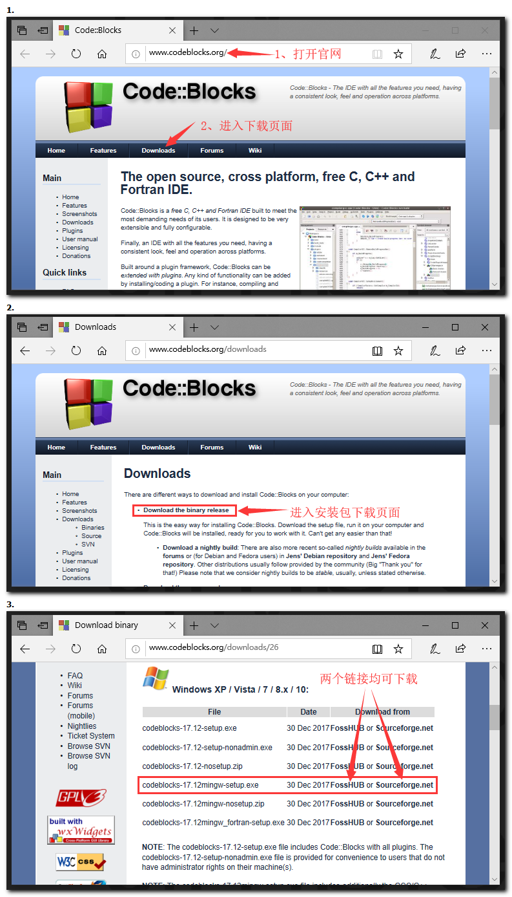
2. 安装Code::Blocks
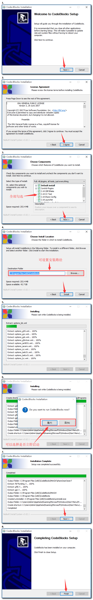

## 配置MinGW

在安装完Code::Blocks之后，MinGW也一并被安装在了你的Windows操作系统中，现在我们要配置一下MinGW中的GCC，方便我们使用它来构建程序。

1. 打开Code::Blocks的安装目录（你的安装目录可能和我不一样），即上面安装Code::Blocks的第四步设置的路径，其安装目录下有一个名为MinGW的文件夹，进入该文件夹后，打开名为bin的目录，然后将这个目录复制到粘贴板:

2. 右击我的电脑，选择属性：
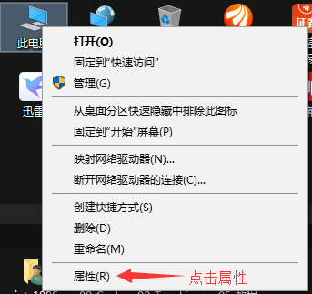
3. 在打开的窗口中选择高级系统设置：
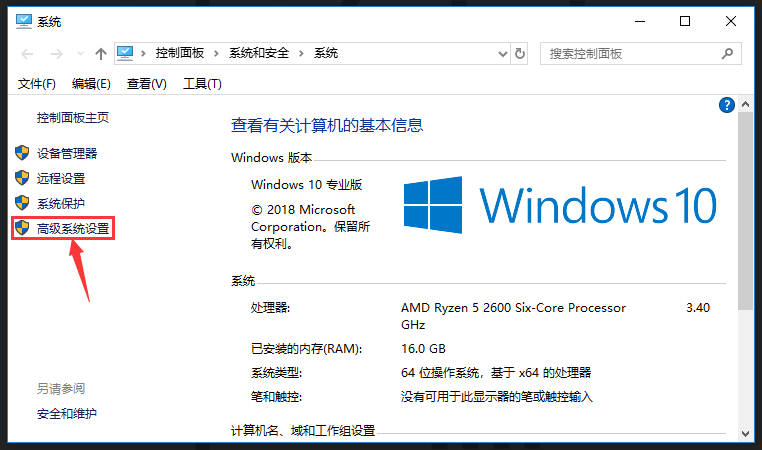
4. 在打开的窗口中选择环境变量：
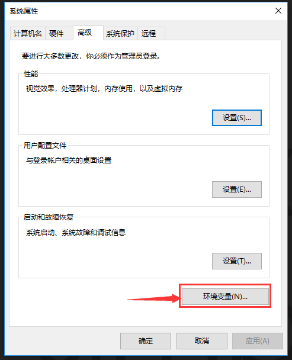
5. 在打开的窗口中，双击系统变量中Path条目：
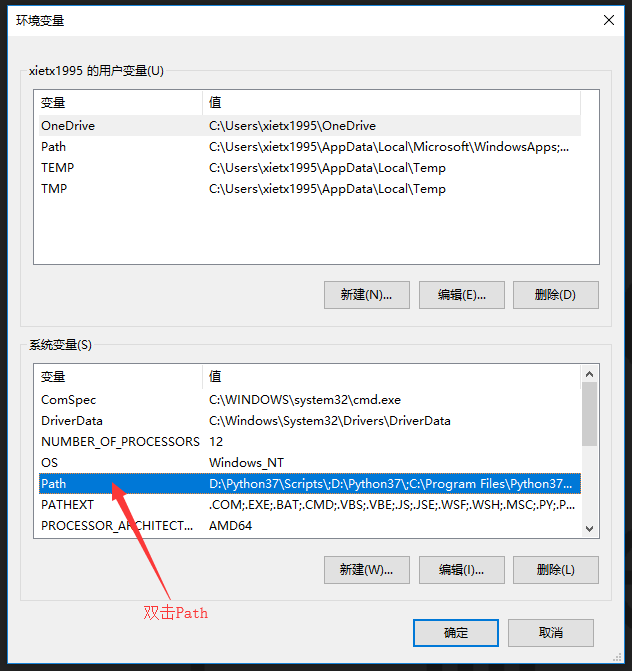
6. 在打开的窗口中，新建条目，粘贴第一步中复制的路径：
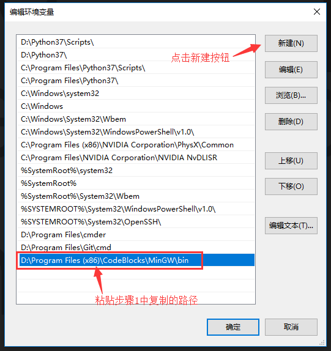
7. 依次点击所有窗口中的确定按钮，关闭所有窗口。

你可能会问：上面这些操作是在做什么？

这个过程叫做**配置环境变量**，GCC的相关工具都位于MinGW的bin目录中，我们把这个目录添加到了系统的环境变量当中，这样的话，我们就可以在命令行中运行gcc命令。你可以这样理解：环境变量就是一张表，里面保存了一些程序的所在的文件夹路径。只要一个程序所在文件夹的路径在环境变量这张表里面，我们就可以从命令行中输入程序的名字，来运行这个程序。

下面你可以试试：

1. 按下键盘上的`Windows + R`键（Windows键即微软徽标键，四个小方块，在键盘左下角`Ctrl`和`Alt`键旁边），会弹出一个运行窗口：
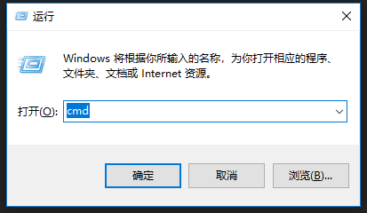
2. 输入`cmd`，按`Enter`键，会显示一个命令行窗口。在命令行窗口中输入`gcc`，然后按`Enter`键，如果出现下面的内容，说明gcc已经能够使用了：

本小节的开头讲了编程环境还包括调试工具和其他工具，目前我们还不需要学习它们，所以环境的搭建先到此为止。后面我们使用Code::Blocks和Visual Studio的时候，我会向大家介绍其他工具的使用方法。

## 小提示

上面的黑框框，即命令行窗口，也是一个程序，使用这个程序可以在整个系统的所有文件夹路径之间跳转，也可以在里面运行程序。如果你现在不清楚它的用法，看到一堆命令感觉很难理解，没关系，随着教程学习，你会越来越熟悉它。

## 小结

初学编程需要几个工具：代码编辑器、程序构建工具、调试工具等

下一节，你将学习编写第一个C语言程序，然后用上面配置好的gcc命令，将源代码文件构建为可执行程序。

## 链接

- [目录](./preface.md)
- 上一节：[第一个C语言程序](./03.0.md)
- 下一节：[编写程序](./03.2.md)